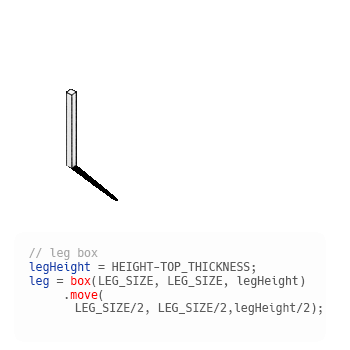
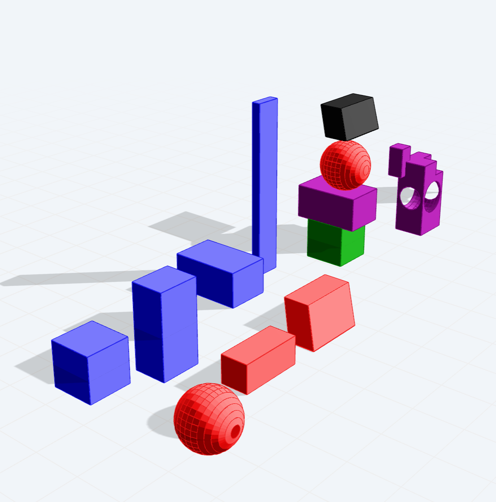
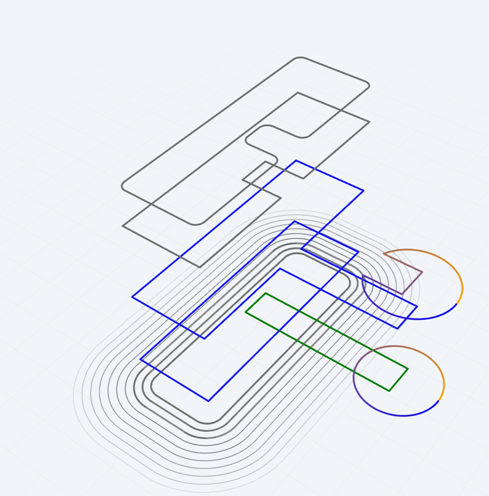
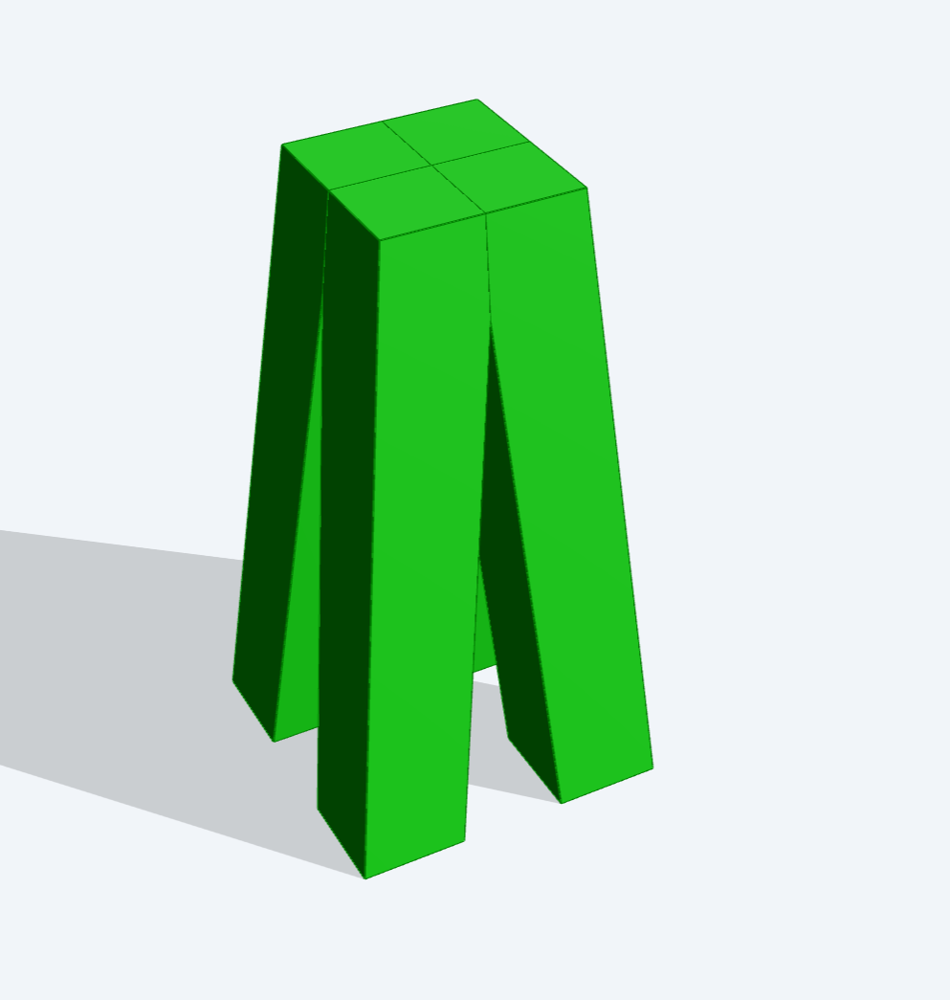
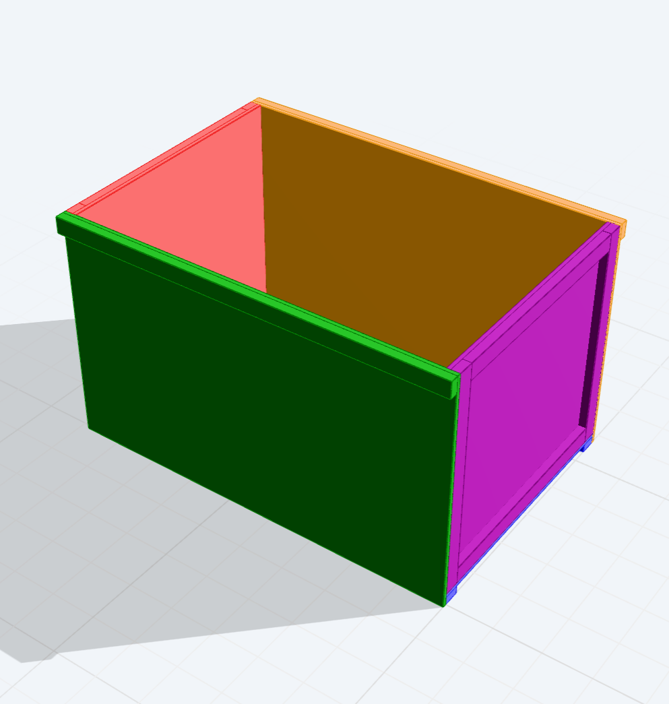
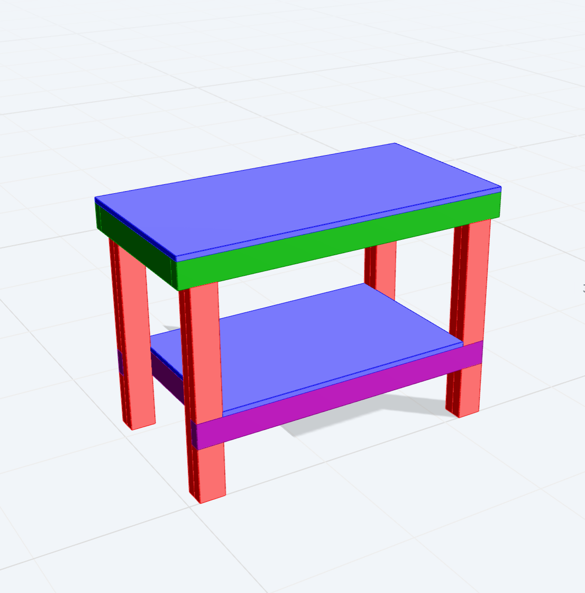
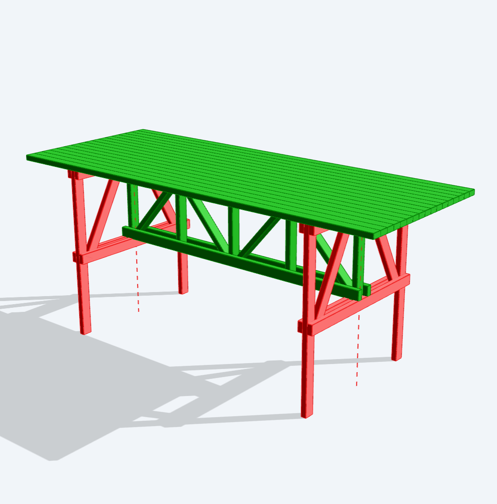
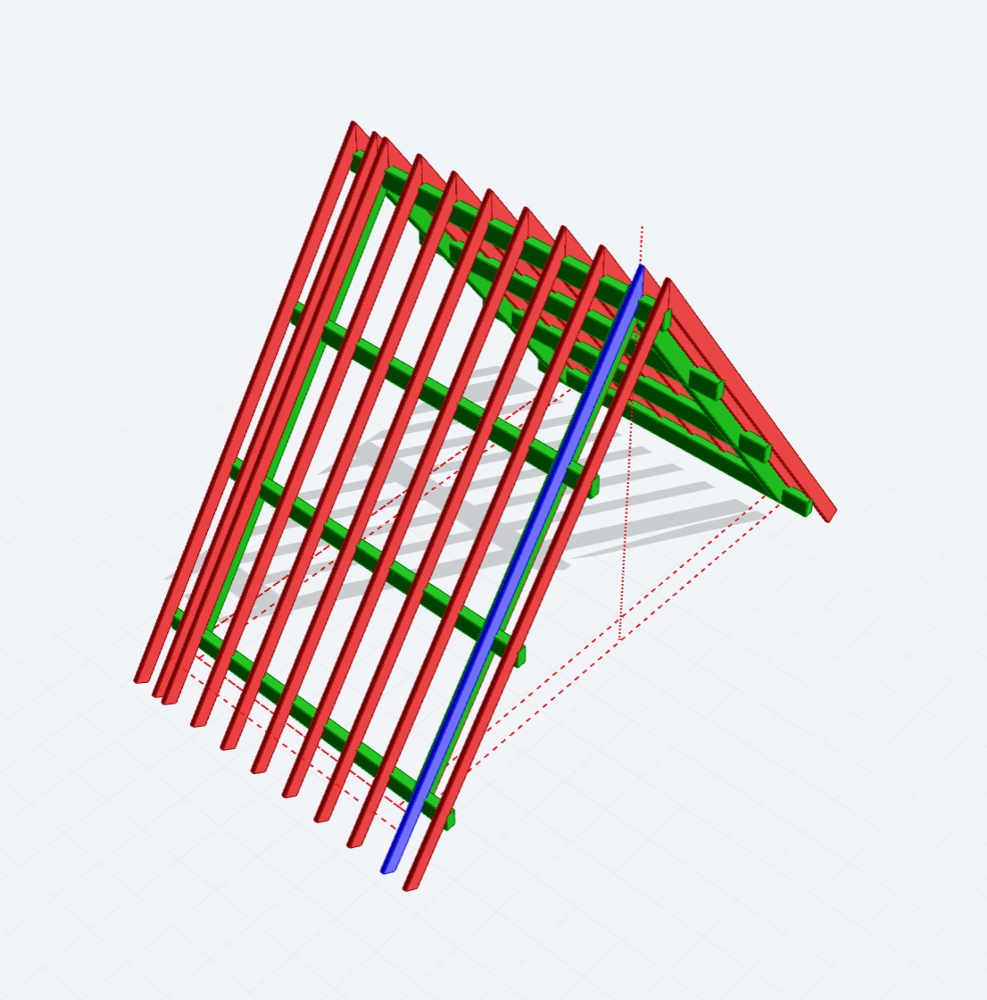
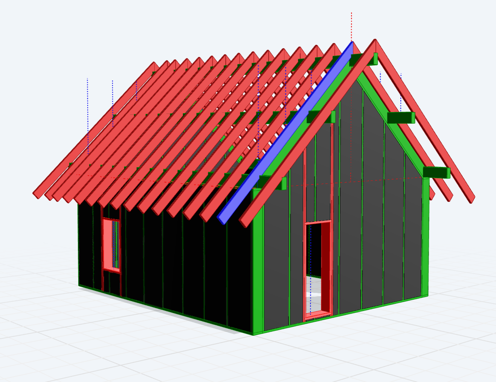

# Archiyou

> [!IMPORTANT]
> **NEW VERSION IS COMING**
> This repo offers the latest version of Archiyou, but our main website and editor are not updated yet. If you want to try the new editor: [next.archiyou.com](https://next.archiyou.com). More is coming! 


[Archiyou](https://archiyou.com) is an online code CAD platform and open source toolchain for **open parametric design and automation**.
It's specialized for making daily things like constructions, furniture and houses and can generate the needed **documentation** like drawings, calculations and lists. 


#### Features



* Minimal object-orientated API that feels like describing your shape.
* A lot of modeling techniques with our mesh and brep kernel: CSG, 2D CAD Sketch, surface modeling
* Exports: GLTF/GLB, DXF, BREP, STL, STEP, PDF, Excel etc.
* Generate documentation: spec sheets, plans, instructables
* *Connected CAD*: Import 2D/3D assets (SVG, GeoJSON, STL) from the web and use for modeling
* Assemble models by using scripts as components
* More than a model: Manage data, pipelines, components and outputs
* Publish your script as parametric model in a configurator and serve to the web
* In a Configurator: Interactive features like dimension lines and handles
* *Upcoming*: Manage your own projects
* **Full open source stack licensed under Apache2**

<p align="center"></p>

#### How Archiyou can be helpful

| Audience | How Archiyou Helps |
| --- | --- |
| DIY Makers | Pick a design, generate your own version, and download the manual. See [our library](https://archiyou.com). |
| (Digital) Designers | Make your design parametric, add documentation, offer it as a configurator and show it off to others. See [our editor](https://next.archiyou.com). You can also use our designs as templates for your own projects.  |
| Developers | Make a (parametric) 3D model by scripting and easily take it wherever you like. If you want to use our geometry kernel see our `packages/core` or npm: [`meshup`](https://www.npmjs.com/package/@archiyou/meshup) or the entire core (upcoming as npm package)  |
| Professional Makers | Use our customizable products in your projects. See [our library](https://archiyou.com). |
| Producers | Offer your clients customizable products and automate design and production without being dependent of CAD licenses |


#### Examples

A few examples and designs built with Archiyou. Click on them to open in the editor. 

<table>
  <tr>
    <td><a href="https://next.archiyou.com/editor/archiyou/example_solids"></a></td>
    <td><a href="https://next.archiyou.com/editor/archiyou/examples_curves"></a></td>
    <td></td>
    <td><a href="https://next.archiyou.com/editor/archiyou/artcrate"></a></td>
  </tr>
  <tr>
    <td><a href="https://next.archiyou.com/editor/archiyou/workbench"></a></td>
    <td><a href="https://next.archiyou.com/editor/archiyou/maritavolo"></a></td>
    <td></td>
    <td></td>
  </tr>
</table>


## What's in here

The entire Archiyou is in this monorepo. It contains all components needed to host your own version, extend interface components, take your Archiyou CAD scripts anywhere or use the geometry kernels.

Here are the most important components:

* **Editor** - [`apps/editor`](./apps/editor/) - The web interface in which to create and publish CAD scripts
* **Configurator** - [`packages/ui/src/configator`](./packages/ui/con) - This allows end-users to configure a parametric model. Configurators can be embedded inside other websites like a Youtube video. Please note that it's served together with the rest of the stack.
* **Server** - [`apps/server`](./apps/server/) - The entire backend for the Archiyou platform which serves the Editor to persist and manage scripts and execute scripts on the backend. `Fastify, BullMQ, SQLite, Drizzle ORM, Redis`
* **Core** - [`packages/core`](./packages/core) - The core modeling for executing CAD script to create models with styling, hierarchy, calculations and documentation. We use two kernels: [`Meshup`](https://github.com/ArchiyouApp/meshup) (mesh based: speed) and a BREP one based on `OpenCascade` (slow but advanced). 
* **UI** - [`packages/ui`](./packages/ui) - All UI components that make up the editor and configurator. `Lit, WebAwesome`
* **Extendability**: Look at [`modules`](./modules) and [`plugins`](./plugins) - *work in progress*
* **Rust-based powertools** - [`packages/gdrr2bp-wasm`](./packages/gdrr2bp-wasm/) and [`collada-wasm`](./packages/collada-wasm/)   

Please look at the seperate README's for the seperate documention of these parts. 


## Development quickstart

Requires **Node 22+** and **pnpm 10.32+**. The mesh kernel is a git submodule, so clone recursively:

```bash
git clone --recursive https://github.com/ArchiyouApp/archiyou.git
cd archiyou
pnpm install
pnpm dev            # editor on :5173, server on :4100
```

Already cloned without `--recursive`? Run `git submodule update --init --recursive`.

No configuration is needed for development: the server creates its SQLite
database on first run, seeds a `test` / `test1234` account, and logs
password-reset and verification emails to the console instead of sending them.

You do **not** need a Rust toolchain to build — all WASM artifacts are committed.
Rust is only required to rebuild a kernel (`pnpm build:wasm`).

#### Develop commands

```bash
pnpm dev                        # editor + server together
pnpm dev:editor                 # editor only
pnpm dev:server                 # server only
pnpm test                       # run all tests
```

The editor's API base URL is baked in **at build time** — see
`apps/editor/.env.example`.


## Configuration

| File | Purpose |
| --- | --- |
| `.env.example` | every server variable, with security notes |
| `apps/editor/.env.example` | the single editor build-time variable |

## Deploying

The `docker-compose.yml` in the root of this monorepo offers a complete single-host deployment: `Caddy` as proxy and automatic HTTPS in front of the API, Editor webapp and server-side execution stack (`BullMQ` and `Redis`). Currently the last one is disabled by default. Uncomment the worker service in the `docker-compose.yml` to enable server-side execution. 

### Configuration

```bash
# 1. configure the deployment
cp .env.example .env
#    set SERVER_JWT_SECRET (openssl rand -base64 48), FRONTEND_URL, REDIS_PASW

# 2. point the hostnames in Caddyfile at your domain, then:
pnpm docker:prod          
# or just: docker compose up
```

There is no build step to run: The Docker stack uses the code in the monorepo, installs dependencies, sets up the workspaces and builds the web app. A fresh deploy is as simple as:

```bash
# update monorepo code and meshup submodule
git pull && git submodule update --init --recursive  
docker compose restart api
```

NOTE: On the first deployment the webapp is build. This takes a bit of time. Before it's done the browser will show an 404 error. Just be patient! 

### The automatic build routine

For whenever something is wrong. Have a look at the build routine and these files:

* `docker-entrypoint.sh` builds when any file under `apps/`, `packages/`,
* `modules/` or the root manifests is newer than `node_modules/.archiyou-build-stamp` — one `find` that stops at the first stale file, so the up-to-date case costs milliseconds. 

The build has this order:

| Package | Output | Consumed by |
| --- | --- | --- |
| `packages/meshup` (a **submodule**) | `dist/` | the editor build — its package `exports` point at `dist`, not `src`, so this must come first |
| `apps/editor` | `dist/` | caddy, as `/srv/app` |
| `modules/*`, `modules/*/*` | `dist/bundle.js` | the server's `ModuleHost`, read in place |

Want to avoid building: `ARCHIYOU_SKIP_BUILD=1` or force it: `ARCHIYOU_FORCE_BUILD=1`

## Contributing

See [CONTRIBUTING.md](CONTRIBUTING.md). Bug reports and small focused pull
requests are very welcome; please open an issue before starting anything large.

## Roadmap 2026

Thanks to [NLnet NGI0 Commons Fund](https://nlnet.nl/project/Archiyou/) we can further develop the open source and open design community functionality of Archiyou. 

This is a basic roadmap:

- [x] Open design user research, strategy and UX/UI
- [x] DevX: Archiyou as module, examples, templates
- [x] New high performance (mesh) geometry kernel: [CSGRS](https://github.com/timschmidt/csgrs) and [Meshup](https://github.com/ArchiyouApp/meshup)
- [x] Fully open source stack (including publishing)
- [x] New lightweight viewer/configurator: portability, extendability
- [x] New editor: more value for more users
- [ ] New open design platform: workspaces, design library

All documentation for NLnet can be found in the [documentation/nlnet](./documentation/nlnet) folder in this repo.

Please reach out for more information, ideas or collaboration!

## AI disclosure

Archiyou started as a good old fashioned non-AI project. Its core was always open source (see deprecated https://github.com/ArchiyouApp/archiyou-core/). While porting and open sourcing the rest of our stack AI was used. First as code assistant (until march 2026), then as agent. We mainly used Claude Sonnet, and then Opus. Most of the work we plan extensively within our team, supported by agents. The agent codes and writes tests, while we review the code, guide coding standards, clarity and test the applications. All our parametric CAD scripts are hand-crafted. 

## License

Apache-2.0 — see [LICENSE](LICENSE) and [NOTICE](NOTICE).

Bundled WebAssembly binaries carry their own licenses. The significant one is
Open CASCADE Technology 7.6 (LGPL-2.1 with the Open CASCADE exception), which the
optional `brep` kernel loads; the default `mesh` kernel does not use it.
[ATTRIBUTION.md](ATTRIBUTION.md) records every third-party component, and for
OpenCascade also the exact source revision, how to rebuild and substitute the
binary, and a written offer for the corresponding source — read it before
redistributing.
