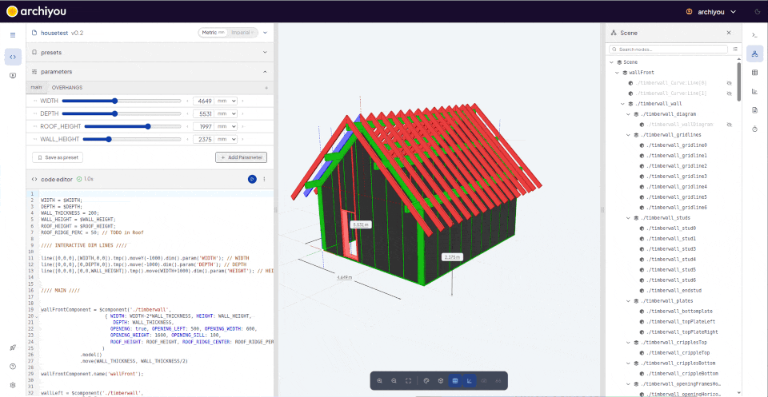
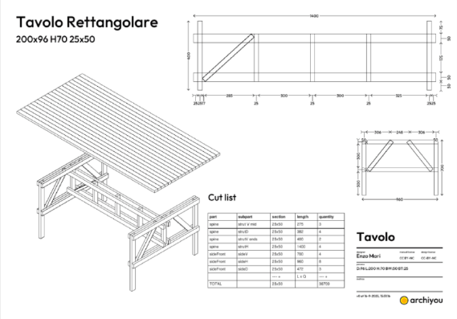

# Archiyou

[Archiyou](https://archiyou.com) is an online code CAD platform and open source toolchain for **open parametric design and automation**.
It's specialized for making daily things like constructions, furniture and houses and can generate the needed **documentation** like drawings, calculations and lists. 



#### Features


* Minimal object-orientated API that feels like describing your shape.
* A lot of modeling techniques with our mesh and brep kernel: CSG, 2D Sketch, surface modeling
* Exports: GLTF/GLB, DXF, BREP, STL, STEP, PDF, Excel etc
* Generate documentation: spec sheets, plans, instructables

* Connected CAD: Import 2D/3D assets (SVG, GeoJSON, STL) from the web and use for modeling
* Assemble models by using scripts as components
* More than a model: Manage data, pipelines, components and outputs
* Publish your script as parametric model in a configurator and serve to the web
* In a Configurator: Interactive features like interactive dimension lines and handles
* *Upcoming*: Manage your projects inside Archiyou
* **Open source and licensed under Apache2**

#### How Archiyou can be helpful

| Audience | How Archiyou Helps |
| --- | --- |
| DIY Makers | Pick a design, generate your own version, and download the manual. See [our library](https://archiyou.com). |
| (Digital) Designers | Make your design parametric, add documentation, offer it as a configurator and show it off to others. See [our editor](https://editor.archiyou.com). You can also use our designs as templates for your own projects.  |
| Developers | Make a (parametric) model by scripting and easily take it wherever you like. |
| Professional Makers | Use our customizable products in your projects. See [our library](https://archiyou.com). |
| Producers | Offer your clients customizable products and automate production without being dependent of CAD licenses |


## What's in here

The entire Archiyou is in this monorepo. It contains all components needed to host your own version, extend interface components, take your Archiyou CAD scripts anywhere or use the geometry kernels.

Here are the most important components:

* Editor - [`apps/editor`](./apps/editor/) - The web interface in which to create and publish CAD scripts
* Server - [`apps/server`](./apps/server/) - The entire backend for the Archiyou platform which serves the Editor to persist and manage scripts and execute scripts on the backend. `Fastify, BullMQ, SQLite, Drizzle ORM, Redis`
* Core - [`packages/core`](./packages/core) - The core modeling for executing CAD script to create models with styling, hierarchy, calculations and documentation. We use two kernels: [Meshup](https://github.com/ArchiyouApp/meshup) (mesh based: speed) and a BREP one based on OpenCascade (slow but advanced). 
* UI - [`packages/ui`](./packages/ui) - All UI components that make up the editor and configurator. `Lit, WebAwesome`
* Rust-based powertools - [`packages/gdrr2bp-wasm`](./packages/gdrr2bp-wasm/) and [`collada-wasm`](./packages/collada-wasm/)   


## Development quickstart

Requires **Node 22+** and **pnpm 10.32+** (`corepack enable` picks the right
pnpm). The mesh kernel is a git submodule, so clone recursively:

```bash
git clone --recursive https://github.com/ArchiyouApp/archiyou.git
cd archiyou
pnpm install
pnpm dev            # editor on :5173, server on :4100
```

Already cloned without `--recursive`? Run `git submodule update --init --recursive`.

No configuration is needed for development: the server creates its SQLite
database on first run, seeds a `test` / `test1234` account, and logs
password-reset and verification emails to the console instead of sending them.

You do **not** need a Rust toolchain to build — all WASM artifacts are committed.
Rust is only required to rebuild a kernel (`pnpm build:wasm`).

#### Develop commands

```bash
pnpm dev                        # editor + server together
pnpm dev:editor                 # editor only
pnpm dev:server                 # server only
```

The editor's API base URL is baked in **at build time** — see
`apps/editor/.env.example`.


## Configuration

| File | Purpose |
| --- | --- |
| `.env.example` | every server variable, with security notes |
| `apps/editor/.env.example` | the single editor build-time variable |

## Deploying

The repo-root `docker-compose.yml` is a complete single-host deployment: Caddy
(automatic HTTPS) in front of the API, Redis, and the built editor served as
static files. The BullMQ execution worker is defined there too but commented
out — uncomment the `worker` service to enable server-side execution. It lives at the root rather than in `apps/server/`
because it deploys the whole monorepo — it builds from the root context and
mounts `apps/editor/dist` and `plugins/`. (`apps/server/docker-compose.yml` is
the *development* stack: server + Redis only.)

```bash
# 1. configure the deployment
cp .env.example .env
#    set SERVER_JWT_SECRET (openssl rand -base64 48), FRONTEND_URL, REDIS_PASW

# 2. point the hostnames in Caddyfile at your domain, then:
pnpm docker:prod          # == docker compose up -d
```

There is no build step to run: the api container installs dependencies and
builds the workspace on boot, from the mounted checkout. A deploy is therefore

```bash
git pull && git submodule update --init --recursive
docker compose restart api
```

and `docker compose build` is needed only when the base image itself changes.
Note that the first boot builds the editor from scratch — minutes, during which
caddy serves 404s — and that **the API does not accept connections until the
build finishes**. Subsequent restarts with no source change are immediate.

### What gets built, and when

`docker-entrypoint.sh` builds when any file under `apps/`, `packages/`,
`modules/` or the root manifests is newer than
`node_modules/.archiyou-build-stamp` — one `find` that stops at the first stale
file, so the up-to-date case costs milliseconds. It builds, in this order:

| Package | Output | Consumed by |
| --- | --- | --- |
| `packages/meshup` (a **submodule**) | `dist/` | the editor build — its package `exports` point at `dist`, not `src`, so this must come first |
| `apps/editor` | `dist/` | caddy, as `/srv/app` |
| `modules/*`, `modules/*/*` | `dist/bundle.js` | the server's `ModuleHost`, read in place |

Nothing else needs building: `apps/server` runs from source via `tsx`, and
`packages/{core,ui,types,module-sdk}` all export `src/`, so their consumers
compile the sources.

This is an explicit list rather than the root `pnpm build`, because **`turbo
build` currently fails outright**: `@archiyou/editor` and `@archiyou/ui` depend
on each other and turbo rejects the cyclic task graph. Break that cycle and the
entrypoint collapses back to a single `pnpm run build`.

Two things the build step deliberately does **not** do:

- **It does not inherit the container's environment.** The build runs under
  `env -i` with an explicit allowlist, because `apps/editor/vite.config.ts` sets
  `envPrefix: ['VITE_','SERVER_']` and this container is started with
  `env_file: .env` — without the scrub, every `SERVER_*` variable, including
  `SERVER_JWT_SECRET`, would be visible to Vite and inlinable into a bundle that
  ships to browsers. `SERVER_API_BASE_URL` is passed through (default `/api`,
  matching the prefix caddy strips) and is inlined at build time, so changing it
  means rebuilding: `ARCHIYOU_FORCE_BUILD=1`.
- **It does not update `modules/`.** That overlay is a separate, gitignored
  repository, so a root `git pull` leaves it untouched — pull it too, then
  restart, and the entrypoint rebuilds it.

Escape hatches: `ARCHIYOU_SKIP_BUILD=1` boots on whatever was built last (useful
if a build breaks on the server), `ARCHIYOU_FORCE_BUILD=1` always rebuilds. The
worker service skips the build automatically — its mount is read-only.

**`apps/editor/dist` is not committed.** Only the empty directory is, via a
`.gitkeep`: docker creates a missing bind-mount source as root, which would
leave the container's uid 1000 unable to build into it.

### What runs from where

| Runs from | Mounted into | Rebuild needed? |
| --- | --- | --- |
| `apps/editor/dist` | caddy `/srv/app` | built by the api container on boot |
| `plugins/` | caddy `/srv/plugins` | no |
| `Caddyfile` | caddy `/etc/caddy` | no — `docker compose restart caddy` |
| the whole checkout | api `/archiyou` | no |

The `apps/server/Dockerfile` image contains **no application code and no
`node_modules`** — just Node, pnpm and a build toolchain. Everything it runs
comes from the bind-mounted checkout, so a deploy is
`git pull && docker compose restart api`, and `docker compose build` is
needed only when the base image itself changes.

Dependencies come from the mount too, so `apps/server/docker-entrypoint.sh`
installs them on boot when needed — you never run `pnpm` on the host. It
installs when `node_modules/.pnpm` is absent (first deploy) or when
`pnpm-lock.yaml` is newer than the stamp it drops at
`node_modules/.archiyou-install-stamp` (a `git pull` changed dependencies).
Otherwise it is a no-op and startup is immediate. Installing inside the image
also means `better-sqlite3` — a native module — is compiled against the exact
Node that loads it.

That install — and the build that follows it — writes into the mounted checkout
as uid 1000 (`USER node`), so the checkout must be writable by it: `sudo chown
-R 1000:1000 <checkout>` on the host. This is not optional now that the editor's
`dist/` is produced there rather than committed; a read-only checkout means the
entrypoint silently skips the build (that is how the worker service opts out)
and caddy serves whatever was there before. Installing by hand keeps the install
step quiet, but not the build:

```bash
docker compose run --rm --user 0 --entrypoint pnpm api install --frozen-lockfile
```

Note this installs the **whole workspace** — editor, Vite, the WASM packages —
not just the server's dependencies, because the mount is the whole monorepo.

The mount is the repo **root**, not `apps/server`: `apps/server` is a workspace
package whose `node_modules` are symlinks into `../../node_modules/.pnpm`, and
pnpm needs the root `package.json`, `pnpm-workspace.yaml` and lockfile. The
containers' `WORKDIR` is `/archiyou/apps/server`, which is what makes `pnpm
start` / `pnpm worker` resolve (from the workspace root they fail with
`ERR_PNPM_NO_SCRIPT_OR_SERVER` and `ERR_PNPM_RECURSIVE_EXEC_FIRST_FAIL`) and
what makes `SERVER_DATABASE_FILE=./data/archiyou.db` land in `apps/server/data`.
That directory is written by uid 1000 (`USER node`): `chown -R 1000:1000
apps/server/data` on the host if the checkout is owned by someone else.

Both `env_file:` and `${REDIS_PASW}` interpolation resolve relative to the
compose file, so the `.env` belongs at the **repo root**. A missing one is quiet,
not loud: `${REDIS_PASW}` becomes an empty string and Redis starts with
`--requirepass ""`.

The compose project is pinned to `name: archiyou`, so the `redis_data` volume
keeps the same name regardless of what the checkout directory is called. Don't
remove the pin — a rename orphans the queue's persisted state.

**The SQLite database is a plain host directory now, not a Docker volume**: it
lives at `apps/server/data/` in the checkout, via the code mount. Back that
directory up (see below) and never `git clean -x` it. The `server_data` volume
is still declared in `docker-compose.yml` but nothing mounts it — the
volume-based restore recipe further down applies only to deployments that
predate the bind mount.

One host serves the editor and proxies `/api/*` to the server, so there is no
cross-origin traffic and CORS never applies. Database migrations run
automatically on boot.

Work through the checklist at the end of [SECURITY.md](SECURITY.md) before
exposing an instance to the internet.

### Backups

`pnpm admin:backup` uploads one timestamped `tar.gz` to any S3-compatible bucket
(AWS, Hetzner, Cloudflare R2, Backblaze B2, DigitalOcean Spaces, MinIO).

**What is in it** is the `backupTargets` list in `apps/server/src/config.ts` —
the SQLite database and the thumbnail SVGs today. That list is the authoritative
answer, and **anything not on it is treated as regenerable and will be lost on
host failure**. When a new kind of durable asset appears, add a line there; the
script needs no other change. `SERVER_BACKUP_EXTRA_PATHS=name:path,…` adds one
without touching code. Deliberately excluded: `data/cache` (regenerable execution
results) and the SQLite `-wal`/`-shm` sidecars.

The database is snapshotted with SQLite's online backup API, so this is safe to
run against a live server and needs **no manual WAL checkpoint** — the archived
file is fully checkpointed and self-contained. Every snapshot is opened and
`PRAGMA integrity_check`ed before it is uploaded, and the archive's
`MANIFEST.json` records what it contained, which migration the database matches,
and the row counts.

Configure the `SERVER_BACKUP_*` block in the root `.env` (see
[`.env.example`](.env.example)), then **verify before scheduling**:

```bash
# from the repo root
# what would be included, and where it would go
docker compose exec api pnpm admin:backup --list
# validates credentials, endpoint and checksum settings — writes nothing
docker compose exec api pnpm admin:backup --dry
# the real thing
docker compose exec api pnpm admin:backup
```

Then schedule it from the **host** crontab (`crontab -e` as the user who owns the
deploy):

```cron
MAILTO=you@example.com
17 3 * * * cd /opt/archiyou && /usr/bin/docker compose exec -T api pnpm admin:backup >> /var/log/archiyou-backup.log 2>&1
```

Four things reliably go wrong here:

- **`-T` is mandatory.** Cron has no TTY, and `exec` without it fails with
  "the input device is not a TTY".
- **`cd` into the repo root first.** Compose resolves `.env` and relative paths
  from the compose file's directory; cron's working directory is `$HOME`.
- **Use an absolute `/usr/bin/docker`.** Cron's `PATH` is minimal.
- **A target must be visible inside the `api` container.** `exec` runs in the
  already-running container, which has `env_file: .env` and the `server_data`
  volume — so `SERVER_BACKUP_*` and `data/` are already there. A new asset path
  *outside* that volume must also be mounted into the `api` service, or the
  script cannot see it.

If the stack may be down at that hour, use `run --rm -T api pnpm admin:backup`
instead — same env and volume, in a throwaway container.

Exit codes matter, because they are what reaches `MAILTO`:

| Code | Meaning |
|---|---|
| `0` | Uploaded, and any pruning completed. |
| `1` | **Backup failed — no new archive exists.** This is the one that should wake you. |
| `2` | Misconfigured (missing bucket/credentials, unusable targets). Nothing was attempted. |
| `3` | The archive is safe; only pruning failed. Look at it Monday. |

**Retention.** After a *successful* upload, archives older than
`SERVER_BACKUP_KEEP_DAYS` (default 30) are deleted. The pruner only ever touches
keys matching its own exact `archiyou-YYYYMMDD-HHmmss.tar.gz` pattern under its
own prefix, always keeps the newest `SERVER_BACKUP_MIN_KEEP` regardless of age,
never empties the prefix, and never deletes more than
`SERVER_BACKUP_MAX_DELETE` in one run. Instances sharing a bucket must use
different `SERVER_BACKUP_S3_PREFIX` values or they will prune each other.

Note the same credentials upload *and* delete, so a compromised server can erase
its own history. If your provider supports lifecycle rules, the stronger setup is
`SERVER_BACKUP_PRUNE=false` plus a bucket lifecycle rule and a write-only key.

#### Restoring

```bash
# 1. fetch and inspect — this touches nothing
aws s3 --endpoint-url "$ENDPOINT" cp "s3://$BUCKET/$PREFIX/archiyou-20260806-031500.tar.gz" .
tar tzf archiyou-20260806-031500.tar.gz
mkdir restore && tar xzf archiyou-20260806-031500.tar.gz -C restore --strip-components=1

# 2. VERIFY BEFORE TOUCHING PRODUCTION
cat restore/MANIFEST.json     # which targets it holds; `migrations` must match this code
sqlite3 restore/db/archiyou.db "PRAGMA integrity_check;"
sqlite3 restore/db/archiyou.db "select count(*) from users; select count(*) from script_versions;"

# 3. stop the stack so nothing holds the database file (from the repo root)
docker compose down

# 4. write each target back to its declared path inside the volume.
#    The volume is `archiyou_server_data`, not `server_data` — compose prefixes
#    it with the project name (`name: archiyou`). Naming it wrong here does not
#    error; docker just creates an empty volume and the restore silently no-ops.
#    Confirm with: docker volume ls | grep server_data
docker run --rm -v archiyou_server_data:/data -v "$PWD/restore:/restore:ro" alpine sh -c '
  cp /restore/db/archiyou.db /data/archiyou.db &&
  rm -f /data/archiyou.db-wal /data/archiyou.db-shm &&
  rm -rf /data/thumbnails && cp -a /restore/thumbnails /data/thumbnails &&
  chown -R 1000:1000 /data'

# 5. back up
docker compose up -d
```

Step 4's `rm -f *-wal *-shm` is not optional: the restored file is already
checkpointed, and leaving the *previous* database's WAL beside it is how a
restore turns into a second incident. `1000:1000` is the `node` user the
container runs as — a root-owned database file breaks the API on boot.

Run steps 1–2 against a scratch directory once a quarter. An untested restore is
not a backup.

### Why a script has no thumbnail

Script thumbnails are iso line drawings generated **in the browser** while the
share/publish dialog is open, sent along with the script, and validated against a
strict allowlist before the server writes them. Every step of that is silent on
purpose — a share must never fail, or wait, because of a preview — so when a
thumbnail does not appear there is nothing on screen and nothing in the database
to explain it.

`apps/server/data/logs/thumbnails.log` is that explanation. One JSON object per
line, both ends of the flow in one file:

```bash
tail -f apps/server/data/logs/thumbnails.log

# only the failures, in a readable form
jq -c 'select(.event=="rejected" or .event=="write-failed" or .step=="generate:error")' \
   apps/server/data/logs/thumbnails.log
```

`src:"client"` lines are the browser's own report of the background run
(`generate:start` → `generate:ok` / `generate:empty` / `generate:error`, then
`submit`); `src:"server"` lines say what arrived and what happened to it
(`received`, `stored`, `rejected`, `write-failed`, `removed`). The three usual
answers read directly off the file:

| What you see | What happened |
| --- | --- |
| `submit` with `state:"pending"`, then `received` with `bytes:0` | The user pressed Share before the background run finished — nothing failed; the preview simply was not ready yet. |
| `generate:empty` | The run produced no drawing: a 2D/docs-only script, or one whose drawing blew the 64 KB cap. `firstError` carries the runner's own message when there was one. |
| `rejected` | The SVG reached the server but is not something our exporter would emit; `reason` names the rule (see `services/svgSanitize.ts`). |

The log rotates at 5 MB (one generation) and is configured by
`SERVER_THUMBNAIL_LOG` — set it empty to switch the whole thing off.

## Contributing

See [CONTRIBUTING.md](CONTRIBUTING.md). Bug reports and small focused pull
requests are very welcome; please open an issue before starting anything large.

## License

Apache-2.0 — see [LICENSE](LICENSE) and [NOTICE](NOTICE).

Bundled WebAssembly binaries carry their own licenses. The significant one is
Open CASCADE Technology 7.6 (LGPL-2.1 with the Open CASCADE exception), which the
optional `brep` kernel loads; the default `mesh` kernel does not use it.
[ATTRIBUTION.md](ATTRIBUTION.md) records every third-party component, and for
OpenCascade also the exact source revision, how to rebuild and substitute the
binary, and a written offer for the corresponding source — read it before
redistributing.
